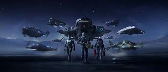

Eleonore Stump argues that we can learn about the problem of suffering by focusing on biblical narratives and virtual environments. Although she doesn’t use the term ‘virtual environment’ the way I do, the term is still appropriate. The biblical narratives Stump analyzes — Abraham, Job, Mary of Bethany — are second-personal environments for encountering mystery, vulnerability, and the conditions for flourishing. As such, even assuming that there are fictional elements, they are sources of truth. We can imagine someone telling the story of Job to an audience, whoever that audience might be.

---

As such, virtual worlds are not escapes from reality, but sites of truth in the form of genuine philosophical inquiry. Art, stories, and even games like Star Citizen and Elite Dangerous, are all not merely entertainment — they are thought experiments we inhabit, raising real questions about identity, reality, value, and the good life. The biblical narratives Stump analyzes — Abraham, Job, Mary of Bethany — are second-personal environments for encountering mystery, vulnerability, and the conditions for flourishing. Game sessions are the same thing, if we make it.

There are not too many existing programs that combine serious philosophical reading with structured gameplay as a method of inquiry. We hope to change this, we are experimental philosophy made accessible.

We've already begun by implementing D&D Campaigns in our introduction to philosophy and philosophy of law courses this past Spring semester at Stetson University. This summer we will be holding a reading group. However, this is a philosophy reading group for the intellectually adventurous.

This summer we’re not only *asking*: Is your ship real? Does your death matter? Can a game give your life meaning — genuine meaning, not just entertainment?

We’ll read David Chalmers, Gabriel Marcel, Eleonore Stump, Martha Nussbaum, and Helen De Cruz — philosophers who take seriously the questions of consciousness, presence, vulnerability, and the good life. Then we’ll fly together in Star Citizen and Elite Dangerous to test the ideas in the only way that matters: by actually inhabiting them.

Every two weeks we meet in-game and debrief in Discord voice chat. No philosophy background required. Just curiosity and a controller.

---

## 📚 The Reading List

[Untitled](Summer%20Reading-Playing%20at%20the%20REAL%20Good%20Life/Untitled%208868935bcf8a837cbc568155aad6de35.csv)

**Supplementary texts:**

- Augustine, *De Musica* Book VI (Jacobsson trans.) — rhythm, beauty, and the soul’s ascent
- Lombard & Ditton (1997) — foundational presence paper
- Gualeni (2016) — existential reflections on virtual worlds
- Cartlidge (2024) — response to Chalmers on video game immersion

---

## 🗓️ Session Schedule

*Base cadence: every two weeks. Compress to weekly if donations support it. Stretch to monthly if they don’t.*

| Session | Date | Reading | Topic | Game | Mission Type |
| --- | --- | --- | --- | --- | --- |
| 1 | Jun 6 | Chalmers, *The Conscious Mind* intro + Ch. 1–2 | What is consciousness? Does virtual presence involve a real mind? | Star Citizen | Starter cargo/courier — notice everything |
| 2 | Jun 20 | Zhai, *Get Real* Ch. 1–4 | Virtual worlds as ontologically serious | Star Citizen | High-risk contract — something at stake |
| 3 | Jul 4 | Marcel, *Homo Viator* — “On the Ontological Mystery” | Mystery vs. problem — virtual worlds as mystery we inhabit | Both | Cooperative — you need each other |
| 4 | Jul 18 | Stump, *Wandering in Darkness* — Union/Presence + Abraham | Gaming with others in second-personal narrative environments | Elite Dangerous | High-risk / death mechanic |
| 5 | Aug 1 | Nussbaum, *Love’s Knowledge*  • *Fragility of Goodness* excerpts | Gameplay emotions as genuine moral knowledge; vulnerability and flourishing | Both | Free mission — something must be at stake |
| 6 | Aug 15 | De Cruz, *Wonderstruck*  • Marcel on hope | Wonder, awe, hope — the good life as orientation toward what transcends us | Both | Exploration only — no combat, pure attention |

---

---

Email [mreynolds1@stetson.edu](mailto:mreynolds1@stetson.edu) to register
